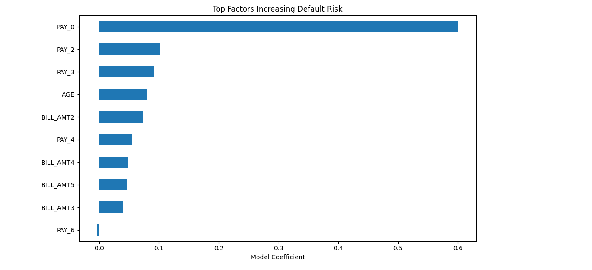

# Credit Risk Prediction

Machine learning project to predict credit default risk and improve identification of high-risk clients in a banking context.

Focus: Risk Management | Credit Analysis | Banking

---

## Key Results

* Accuracy: ~75%
* Recall (default class): improved from 24% to 54%
* Better identification of high-risk clients

---

## Model

* Logistic Regression
* StandardScaler
* Class imbalance handling (class_weight)

---

## Key Insights

* Payment history (PAY_0, PAY_2, PAY_3) is the strongest predictor
* Behavioural variables are more relevant than static financial variables
* Model significantly improves detection of risky clients

---

## Feature Importance

---

## Run the Project

Open in Google Colab:
https://colab.research.google.com/github/ricardoserodio/credit-risk-prediction/blob/main/credit_risk_prediction.ipynb

---

## Files

* `credit_risk_prediction.ipynb` – main notebook
* `feature_importance.png` – model insights

---

## Author

Ricardo Serôdio
