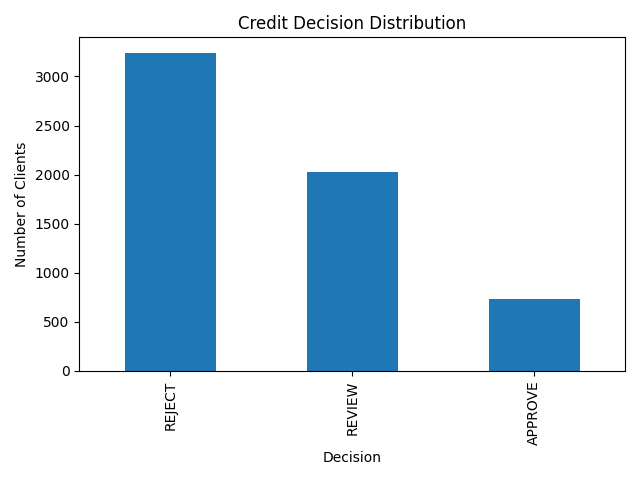

# Credit Risk Prediction

This project simulates a real-world credit risk assessment system used by financial institutions to support lending decisions.

It combines machine learning with a decision engine to classify clients into actionable categories:
- APPROVE (low risk)
- REVIEW (medium risk)
- REJECT (high risk)

The goal is to improve risk detection while supporting practical credit decision workflows.

Focus: Risk Management | Credit Analysis | Banking

---

## Key Results

- Accuracy: ~75%
- Recall (default class): improved from 24% to 54%
- Better identification of high-risk clients

---

## Business Impact

- Improves identification of high-risk clients, reducing potential credit losses
- Supports more consistent and data-driven credit decisions
- Enhances client segmentation into actionable risk categories (Low / Medium / High)

---

## Model

- Logistic Regression
- StandardScaler
- Class imbalance handling (class_weight)

---

## Key Insights

- Payment history (PAY_0, PAY_2, PAY_3) is the strongest predictor
- Behavioural variables are more relevant than static financial variables
- Model significantly improves detection of risky clients

---

## Feature Importance

---

## Run the Project

Open in Google Colab:  
https://colab.research.google.com/github/ricardoserodio/credit-risk-prediction/blob/main/credit_risk_prediction.ipynb

---

## How to Use

1. Open the notebook in Google Colab  
2. Upload the dataset (`credit_default.csv`) when prompted  
3. Run all cells to:
   - Train the model  
   - Evaluate performance  
   - View feature importance  
   - Generate decisions and risk levels  

---

## Use Case

This system can be integrated into financial institutions to:

- Identify high-risk clients before granting credit  
- Improve credit approval decisions  
- Support risk management and compliance processes  

---

## Decision Engine

The project includes a rule-based decision layer on top of model predictions:

- Probability < 20% → APPROVE (Low Risk)  
- Probability between 20% and 40% → REVIEW (Medium Risk)  
- Probability > 40% → REJECT (High Risk)  

This bridges the gap between predictive modeling and real-world credit decision processes.

---

## Model Output

### Credit Decision Distribution

### Decision Output Summary

- Reject: 3,237 clients  
- Review: 2,027 clients  
- Approve: 736 clients  

### Sample Results

| Probability | Decision | Risk Level |
|------------|--------|-----------|
| 0.28       | REVIEW | Medium    |
| 0.45       | REJECT | High      |
| 0.09       | APPROVE| Low       |

---

## Files

- `credit_risk_prediction.ipynb` – main notebook  
- `feature_importance.png` – model insights  
- `decision_distribution.png` – decision output visualization  
- `credit_risk_decisions.csv` – prediction results  

---

## Author

Ricardo Serôdio
