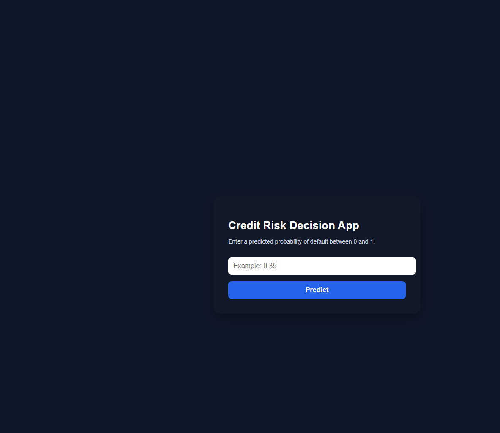
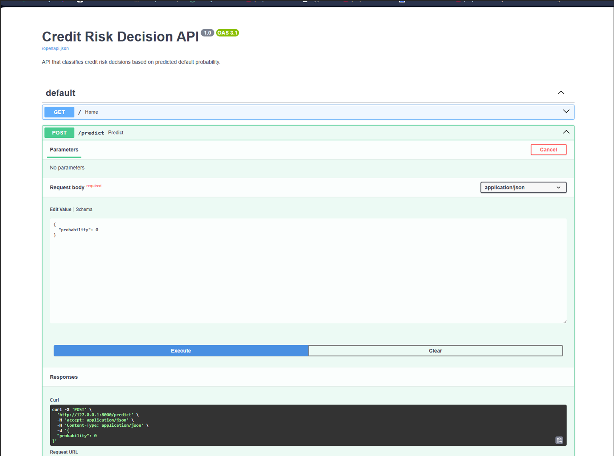
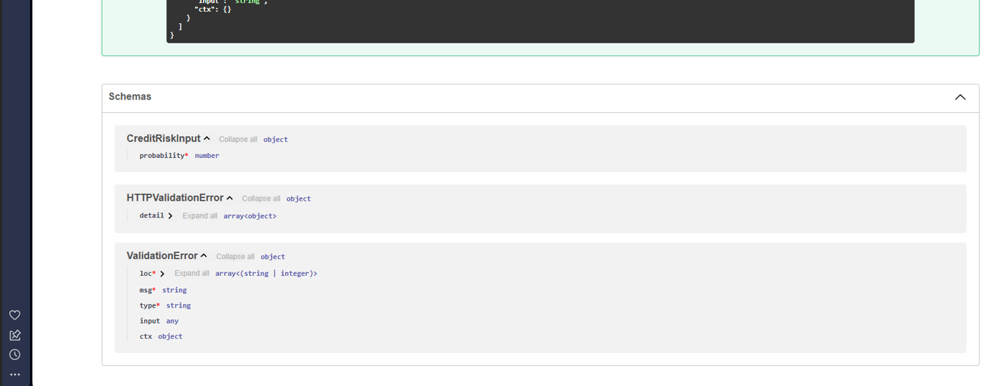

# Credit Risk Prediction

This project simulates a real-world credit risk assessment system used by financial institutions to support lending decisions.

It combines machine learning with a decision engine to classify clients into actionable categories:

- APPROVE (low risk)
- REVIEW (medium risk)
- REJECT (high risk)

The goal is to improve risk detection while supporting practical credit decision workflows.

**Focus:** Risk Management | Credit Analysis | Banking

---

## 🖥️ Web Application



A simple interface that allows users to input a probability of default and instantly receive a credit decision.

---

## ⚙️ API (FastAPI)



This project includes a FastAPI backend that exposes a real-time decision endpoint.

### Endpoint

POST /predict

### Input

```json
{
  "probability": 0.35
}
```

### Output

```json
{
  "probability": 0.35,
  "decision": "REVIEW",
  "risk_level": "Medium"
}
```

---

## API Schema



The API expects a numeric probability between 0 and 1 and returns a structured decision.

---

## Key Results

- Accuracy: ~75%
- Recall (default class): improved from 24% to 54%
- Better identification of high-risk clients

---

## Business Impact

- Improves identification of high-risk clients, reducing potential credit losses  
- Supports more consistent and data-driven credit decisions  
- Enhances client segmentation into actionable risk categories (Low / Medium / High)

---

## Model

- Logistic Regression  
- StandardScaler  
- Class imbalance handling (`class_weight`)  

---

## Key Insights

- Payment history (PAY_0, PAY_2, PAY_3) is the strongest predictor  
- Behavioural variables are more relevant than static financial variables  
- Model significantly improves detection of risky clients  

---

## Dataset

This project uses the **Default of Credit Card Clients dataset**.

Source:  
https://www.kaggle.com/datasets/uciml/default-of-credit-card-clients-dataset

⚠️ The dataset is not included in this repository.

### Includes:

- Demographics (age, gender, education)  
- Credit limits  
- Payment history  
- Billing amounts  
- Previous payments  

### Target:

default.payment.next.month

---

## ⚙️ Decision Engine

The system converts probabilities into business decisions:

- Probability < 20% → APPROVE (Low Risk)  
- Probability between 20% and 40% → REVIEW (Medium Risk)  
- Probability > 40% → REJECT (High Risk)  

---

## 📁 Project Structure

```
credit_risk_prediction.ipynb
api.py
requirements.txt
feature_importance.png
decision_distribution.png
credit_risk_decisions.csv
```

---

## ▶️ Run the Project

### 1. Install dependencies

```bash
pip install -r requirements.txt
```

### 2. Run the API

```bash
uvicorn api:app --reload
```

### 3. Open in browser

http://127.0.0.1:8000/docs

---

##  Use Case

This system can be integrated into financial institutions to:

- Identify high-risk clients before granting credit  
- Improve credit approval decisions  
- Support risk management and compliance processes  

---

## Author

Ricardo Serôdio
